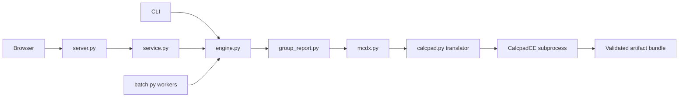

# Architecture

This describes the shipped application. The [Prime feature review](mathcad-prime-review.md) describes the larger product target and gaps.

## Conversion path



| Module | Responsibility |
| --- | --- |
| `cli.py`, `generate.py`, `validate.py` | Commands, arguments, output and exit codes |
| `engine.py` | Transport-independent inspect/convert/validate/summary API and staged publication |
| `group_report.py` | Final summary parsing, case selection and envelopes |
| `mcdx.py` | Package safety checks and constrained native template modifications |
| `calcpad.py` | Strict XML-to-Calcpad translation, subprocess deadline and result validation |
| `calcpad_bridge/` | Small .NET executable driving CalcpadCE; source in, HTML/errors out |
| `setup_engine.py` | Build a pinned engine revision for the current platform |
| `inspection.py` | Read-only document reconstruction and expression differences |
| `service.py` | Session registry, opaque file IDs, uploads/previews/history and conversion lock |
| `server.py` | FastAPI/Uvicorn, authentication, origin checks, limits and static assets |
| `web/` | Browser workflow and file viewer; no independent design solver |
| `batch.py` | Input discovery, bounded process pool, job identity, manifest and resume |
| `summary.py` | `gdcalc summary` input discovery and exclusive CSV write; rows come from `engine.py` |

## Public Python API

```python
from mcdxkit.engine import inspect_report, convert, validate

inspection = inspect_report('report.gp11t', cases=[1, 3, 7])
result = convert(
    'report.gp11t', 'reference.mcdx', 'new-output/design.mcdx',
    cases=[1, 3, 7], load_source='effects', overrides={},
)
package_check = validate(result['output'])
```

Inputs and formula definitions remain in generated files. CalcpadCE executes translated expressions; Python is responsible for orchestration and source interpretation. General Mathcad expression coverage is not implemented. Extending Calcpad support should include explicit type/unit semantics and fixtures for every newly supported construct.

## Storage and consistency

Single conversion stages four artifacts in the destination filesystem and publishes without overwriting. Audit JSON is the completion marker. Hard-link support is required; publication failures roll back only artifacts created by the attempted operation.

Batch identity includes source/template content, settings and engine/translator versions. Resume checks artifacts before skipping work. Browser and batch histories retain private source/template snapshots for comparison. Back up the full output directory, not only the visible worksheet file.

Session file IDs resolve through a server-side registry; clients cannot choose arbitrary server filesystem paths. Temporary uploads and previews are session state. Completed artifacts and audits are durable. The current server has shared workspace state, serialized conversion and no multi-tenant authorization model. A reverse proxy or multiple replicas does not add tenant isolation.

## Execution and trust boundaries

The report parser accepts bounded text inputs. Package inspection checks ZIP expansion and XML/relationship constraints. The translator only generates a restricted Calcpad language subset and rejects unsupported content. The bridge executes generated source with a deadline. Calculation HTML is handled separately from original-file content. Cached Mathcad values are visibly distinct from fresh results.

Do not turn the bridge into a general uploaded-code endpoint by simply bypassing the translator. General worksheets introduce includes, file reads/writes and richer executable content. That requires explicit capabilities, isolated execution/storage and validation of dependencies and output markup.

The HTTP layer checks Host/Origin, request tokens and hosted login state. Network mode requires a strong access token and configured public origin. Hosted mode uploads engineering files to that server. See [deployment](../deploy/README.md) for TLS, persistence and limits.

## Extending the system

- Add source formats behind parsing adapters returning explicit units, cases and provenance. Do not merge different report sections as an undocumented fallback.
- Add template profiles with declared geometry, layout, inputs and supported expressions. Do not loosen the existing profile to accept ambiguous definitions.
- Extend calculation coverage independently from file inspection. Rendering a construct does not prove it calculates correctly.
- Keep CLI, browser and batch on one engine API. A future editable worksheet model must own both displayed expressions and executed expressions.
- Native Prime execution belongs behind a separate Windows adapter with actual version/run evidence. It is absent today; Linux Docker builds do not provide it.
- Distributed hosting needs durable jobs, per-project permissions and isolated storage. The current worker pool is local batch processing.

## Build and publication

`pyproject.toml` defines the Python package and assets. The multi-stage Dockerfile builds the pinned calculator, installs Python dependencies, then runs as UID/GID 10001. `.dockerignore` is an allowlist to prevent private project data entering images.

Actions tests Python versions and package contents before container checks. Only a successful `main` run pushes the exact tested image to GHCR. Pull-request code is tested without registry login or publication. The repository's public source, registry package visibility and a live hosted deployment are separate states.
