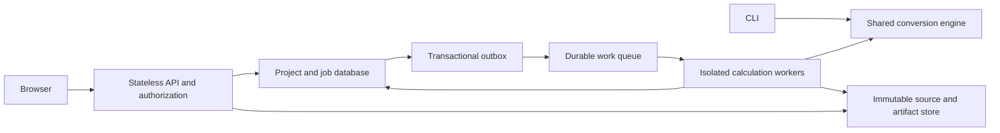

# Distributed execution boundary

Status: design contract for future implementation. The current server is a serialized shared workspace; `batch.py` is a local worker pool. Terraform's VM examples deploy that supported mode. No durable multi-user API or cloud queue adapter is claimed here.

Keep one monorepo and one calculation engine. Split operational responsibilities when distributed hosting is implemented:

| Boundary | Owns | Must not own |
| --- | --- | --- |
| Domain/engine | Parsing, template transforms, units, calculation evidence, staged four-file bundle | Cloud SDK, login, HTTP or queue transport |
| API | Identity, project authorization, bounded uploads, immutable job request, status/download authorization | Long-running equations or process-local authoritative job state |
| Job repository | Versioned job records, idempotency, lease/fencing token, state transitions, outbox | Client-selected server paths or artifact contents |
| Worker | Claim/renew lease, fetch and verify inputs, isolated scratch directory, call engine, verify/publish results | User authorization decisions or duplicate formulas |
| Artifact adapter | Tenant/project scoped immutable objects, checksums and final manifest | Assuming object stores implement filesystem hard links |
| UI | Poll job status, show real completed stages/files, inspect/download artifacts | Simulated progress, silent retries that create duplicate calculations |

## State and delivery

Create a job with an idempotency key scoped to the authenticated project. Its canonical identity includes source/template hashes, selected cases, load basis, overrides and engine/translator versions. Identical keys with different input identities return a conflict. Persist the job and an outbox message in one database transaction; publish the outbox asynchronously. This prevents a database success/queue failure from losing work.

Queue delivery is at least once. Workers claim a bounded lease atomically and renew it during execution. A fencing token prevents an expired worker from overwriting a newer attempt. States are `queued`, `running`, `succeeded`, `failed` and `cancelled`, with attempt history and bounded retries for transient infrastructure failures. Invalid input, unsupported formulas and design-check failures are not infrastructure retry triggers. A failed engineering check can be a successful calculation job.

Calculate on a local filesystem using the existing engine. Upload artifacts under an immutable attempt prefix, check their hashes, then publish a manifest and atomically mark that fenced attempt successful. Downloads are available only through that committed manifest. Partial uploads remain inaccessible and expire under a lifecycle policy. Cancellation must terminate the owned subprocess; test races with completion, retry and lease expiry.

## Security and operating contract

Authenticate users with an established OIDC provider and authorize every project/job/object action. A random ID is not authorization. Never reuse the current single shared access token as a tenancy model. Short-lived signed downloads must be narrowly scoped and expire; audit access separately from calculation evidence. Encrypt storage, scope worker identities to their queues/object prefixes, isolate scratch space, bound CPU/memory/time and avoid unrestricted network/file access during calculation.

Record structured operational events with job/attempt IDs, state changes, durations and error categories. Do not log report contents, access tokens, signed URLs or full private filenames. Expose liveness separately from readiness. Measure queue age, retries, worker timeouts, failed artifact publication and storage growth. Declare retention/deletion/backup policies; deletion requires authorization and cannot silently erase issued revisions.

## Provider adapters

| Responsibility | AWS candidate | GCP candidate |
| --- | --- | --- |
| API/worker runtime | ECS/Fargate services/tasks | Cloud Run service and authenticated worker service or jobs |
| Durable job metadata | PostgreSQL on RDS | PostgreSQL on Cloud SQL |
| Queue | SQS with dead-letter queue | Cloud Tasks or Pub/Sub with bounded retry/dead-letter handling |
| Objects | Private S3 bucket | Private Cloud Storage bucket |
| Identity/secrets | OIDC, IAM roles, Secrets Manager | OIDC, service identities, Secret Manager |

These are candidates, not newly required dependencies. Reuse a maintained task framework or database outbox implementation after evaluating licenses, failure semantics and local development support. Choose one cloud adapter for a first implementation; do not build two separate engines. Container instance replacement and request deadlines are normal events, not exceptional recovery cases. [Cloud Run's task documentation](https://docs.cloud.google.com/run/docs/triggering/using-tasks) and [ECS's storage options](https://docs.aws.amazon.com/AmazonECS/latest/developerguide/using_data_volumes.html) describe provider constraints.

## Acceptance gates before adding replicas

- Duplicate delivery produces one committed result; a stale worker cannot publish after lease expiry.
- API/worker crash recovery, queue failure, cancellation and partial object upload preserve original inputs and issued artifacts.
- Cross-project access is denied for upload, status, view, diff, history and download, including guessed IDs.
- Calculation results match CLI fixtures using the same pinned engine and source hashes.
- Progress survives reconnect and reports actual events; templates/outputs never contain progress markup.
- Backups restore metadata and object manifests together; integrity verification detects missing/tampered objects.
- Local CLI and browser still work with outbound network denied after setup.
- Contract/migration tests run independently of provider credentials; staging failure-injection tests cover the real chosen provider.

Implement through separate tickets: identity/project ownership, durable job/outbox, worker execution, artifact adapter, API/UI job integration, then provider rollout and restore drills. Do not scaffold empty runtime packages as though those features already exist.
