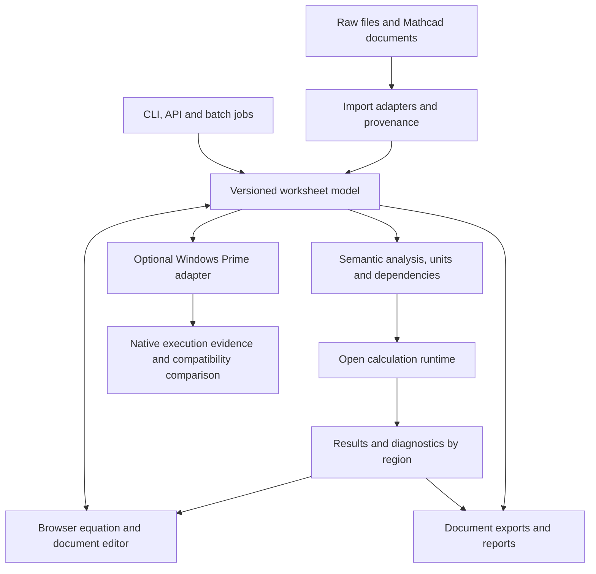

# mcdxkit: Mathcad Prime feature baseline and product gaps

Reviewed 6 October 2026 against PTC documentation and the local mcdxkit implementation.

**Product requirement: a complete, independently usable engineering worksheet application, with Mathcad Prime as the capability baseline, extended by raw engineering imports, traceable validation, batch automation, CLI and browser workflows.**

The current implementation is a useful conversion pipeline, file inspector and limited scalar calculation adapter. It does not yet meet that requirement. An optional Windows Prime connection can provide native execution and compatibility testing later; it cannot substitute for mcdxkit's own worksheet experience.

**Open-source implementation direction:** reuse CalcpadCE as the primary engineering runtime, evaluate SymPy for symbolic work, and build the editable document/pipeline integration around them. Eight local CalcpadCE probes passed during this review; see section 8. The missing capabilities in mcdxkit must not be mistaken for missing capabilities in its underlying engine.

This is a capability-family review, not a claim that every function, dialog or numerical edge case has been tested. No Mathcad Prime installation is available. Native opening, calculation, saving and rendering remain unverified.

## 1. Baseline and versions

PTC's current release page identifies **Prime 12.0.1.0**, released September 2026. The supplied engineering template originates from Prime 10. Version-specific compatibility must therefore be tracked explicitly. Prime 10 introduced advanced controls and solver algorithm selection; Prime 11 added manual calculation mode, custom unit systems and Python controls. Prime 12 adds native 2D plot formatting, solver and symbolic enhancements, and document improvements. [PTC release information](https://www.ptc.com/en/products/mathcad/whats-new)

The 12.0 help index distinguishes the original release from maintenance changes, including .NET 10 and Python 3.14 support in 12.0.1.0. Pin the actual build in compatibility tests rather than treating all “Prime 12” installations as identical. [Prime help index](https://support.ptc.com/help/mathcad/r12.0/en/PTC_Mathcad_Help.html)

## 2. Feature coverage

“Missing” below means absent from the current mcdxkit application or its importer/calculation path. It does not mean an underlying third-party library could never support it. Preserving an opaque region in a ZIP package is also different from editing, rendering or executing it correctly.

| Feature family | Prime baseline | mcdxkit today | Required product behavior |
| --- | --- | --- | --- |
| Live engineering notebook | Equations, formatted text, images and plots together; changing inputs recalculates results. [Overview](https://support.ptc.com/help/mathcad/r12.0/en/PTC_Mathcad_Help/about_using_mathcad.html) | File reconstruction and separate calculated HTML. No general equation editor. | Edit and calculate directly in the visible worksheet; save, reopen and continue working. |
| Region and page editing | Move, resize, copy and format regions; headers, footers, page breaks, text styles, search, spell checking and keyboard workflows. [Help index](https://support.ptc.com/help/mathcad/r12.0/en/PTC_Mathcad_Help.html) | Inspection supports positions, text, images, pages and search. Authoring missing. | Structured equation editing, document layout, undo/redo and reliable pagination. |
| Definitions and evaluation semantics | Named variables/functions, global definitions, labels and subscripts, calculation control and error tracing. [Help index](https://support.ptc.com/help/mathcad/r12.0/en/PTC_Mathcad_Help.html) | Selected scalar definitions only. | Preserve scope, definition order, redefinitions and identifier identity; show errors at the responsible expression. |
| Numeric operators and types | Operators depend on operand types; for example, the same notation can represent scalar absolute value or matrix determinant. [Operators](https://support.ptc.com/help/mathcad/r12.0/en/PTC_Mathcad_Help/about_operators.html) | Real scalar arithmetic, powers, roots, comparisons and a few functions. | Typed expressions and explicit real, complex, Boolean, string and array semantics. |
| Units and dimensions | SI, USCS, CGS, user-defined units, automatic dimensional checks and display conversion; absolute and differential temperatures differ. [Units](https://support.ptc.com/help/mathcad/r12.0/en/PTC_Mathcad_Help/about_units.html) | Translator accepts `in`, `ft`, `kip`, `ksi`. | General dimensional quantities, custom units, display units and correct temperature semantics. |
| Custom unit systems | Configurable base/derived display units and simplification rules. [Custom systems](https://support.ptc.com/help/mathcad/r11.0/en/PTC_Mathcad_Help/custom_units.html) | Missing. | Document-level unit preferences independent of stored physical values. |
| Vectors, matrices and tables | Arrays, indexing, matrix operations, decomposition, sorting and lookup. [Arrays](https://support.ptc.com/help/mathcad/r12.0/en/PTC_Mathcad_Help/about_vectors_and_matrices.html), [matrix functions](https://support.ptc.com/help/mathcad/r12.0/en/PTC_Mathcad_Help/about_vectors_and_matrix_functions.html) | Calculation adapter is scalar. | Editable arrays/tables, vectorization, shape checking and matrix algebra. |
| Calculation settings | `ORIGIN`, convergence tolerance `TOL`, constraint tolerance `CTOL` and other system variables affect behavior. [System variables](https://support.ptc.com/help/mathcad/r12.0/en/PTC_Mathcad_Help/built-in_constants_and_variables.html) | No general compatibility implementation. | Settings belong to the document and execution record; indexing/tolerance changes must invalidate affected results. |
| Numerical calculus | Derivatives, roots and differential-equation calculations form part of the notebook engine. [Overview](https://support.ptc.com/help/mathcad/r12.0/en/PTC_Mathcad_Help/about_using_mathcad.html) | Missing from translator. | Numerical differentiation/integration, sums/products and documented convergence/error behavior. |
| Solve blocks and optimization | Linear/nonlinear systems, constraints, guesses, tolerances and optimization. [Solve blocks](https://support.ptc.com/help/mathcad/r12.0/en/PTC_Mathcad_Help/about_solve_blocks.html) | Missing. | First-class solve regions with solver options and diagnostics; failure to converge must never look like a valid result. |
| ODE/PDE workflows | ODE solve blocks; Prime 9 introduced `pdesolve`. [Solve blocks](https://support.ptc.com/help/mathcad/r12.0/en/PTC_Mathcad_Help/about_solve_blocks.html), [release history](https://www.ptc.com/en/products/mathcad/whats-new) | Missing. | Initial/boundary conditions, solver configuration, solution arrays/functions and plotting. |
| Symbolic mathematics | Exact and variable-precision evaluation, symbolic calculus and matrix expressions. [Symbolic evaluation](https://support.ptc.com/help/mathcad/r12.0/en/PTC_Mathcad_Help/about_symbolic_evaluation.html) | Missing. | A symbolic engine with assumptions and explicit symbolic/numeric boundaries. |
| Worksheet programming | Branching, `for`/`while`, recursion, `break`, `continue`, `return`. [Programming](https://support.ptc.com/help/mathcad/r12.0/en/PTC_Mathcad_Help/programming_strategies.html) | Selected conditional programs and early returns. | User-defined functions and programs, bounded execution, local scopes and useful error locations. |
| Scientific function library | Broad mathematical, statistical and engineering families; inventory below. [Catalog](https://support.ptc.com/help/mathcad/r12.0/en/PTC_Mathcad_Help/about_built-in_functions.html) | Narrow scalar subset. | Versioned function registry with signatures, unit rules, examples and compatibility tests. |
| Plotting | XY, polar, contour and 3D plots. [Plots](https://support.ptc.com/help/mathcad/r12.0/en/PTC_Mathcad_Help/about_plots.html) | No editable calculated plot system. | Plots bound to worksheet expressions, recalculated when dependencies change. |
| Chart components | Separate chart tooling includes axes, traces, titles, legends and a second Y-axis. [Help index](https://support.ptc.com/help/mathcad/r12.0/en/PTC_Mathcad_Help.html) | Missing. | Chart editing and export without detaching data from calculations. |
| File/data access | Text, delimited, binary, CSV, Excel, image and WAV read/write functions. [File functions](https://support.ptc.com/help/mathcad/r12.0/en/PTC_Mathcad_Help/about_functions_for_reading_and_writing_files.html) | Dedicated GROUP report parser; general worksheet file access missing. | Declared document dependencies, reproducible imports and controlled file access. |
| Excel integration | Read/write functions and embedded Excel components; embedded calculation requires Excel, while read/write functions do not. [Excel integration](https://www.ptc.com/en/blogs/cad/mathcad/using-excel-read-write-component) | Excel input unsupported by current report parser. | Distinguish imported cell values, formulas and external workbook execution; track cell provenance. |
| Interactive controls | Buttons, radio buttons, list boxes, checkboxes, text boxes and sliders with scripting. [Controls](https://support.ptc.com/help/mathcad/r12.0/en/PTC_Mathcad_Help/advanced_controls.html) | Conversion form only. | Document controls bound to actual variables; scripts require an explicit execution policy. |
| Reusable templates | `.mctx`, private/shared templates and worksheet-to-template saving. [Templates](https://support.ptc.com/help/mathcad/r12.0/en/PTC_Mathcad_Help/about_templates.html) | One constrained pile-design template profile. | Reusable, versioned document templates with input/output contracts. |
| Included worksheets | Included definitions participate in worksheet order; parent calculation settings apply. [Includes](https://support.ptc.com/help/mathcad/r12.0/en/PTC_Mathcad_Help/to_reference_worksheets.html) | General include execution missing. | Dependency resolution, dependency hashes, cycle detection and portable project bundles. |
| Areas and protection | Collapsible groups, hidden calculations, disabled regions and area protection; PTC cautions that protection is not security. [Areas](https://support.ptc.com/help/mathcad/r12.0/en/PTC_Mathcad_Help/about_areas.html) | Template generator rejects area-containing structures. | Grouping/collapse, calculation state, editing locks and separate access controls. |
| Document formats and output | `.mcdx`, `.mctx`, RTF, XPS and PDF; Prime PDF saving uses Microsoft Print to PDF. [Formats](https://support.ptc.com/help/mathcad/r12.0/en/PTC_Mathcad_Help/about_file_formats.html) | Native package output plus `.cpd`, HTML and audit JSON. | Editable portable project, compatibility exports and paginated reports from the same document revision. |
| Legacy migration | Legacy conversion flags unsupported content and can preserve it as an image; conversion is not universally lossless. [Legacy conversion](https://support.ptc.com/help/mathcad/r11.0/en/PTC_Mathcad_Help/converting_legacy_mathcad_worksheets.html) | No legacy converter. | Explicit migration coverage and visible unsupported regions; never count an image as an executable equation. |
| CAD/PLM integration | Creo and Windchill integration. [Overview](https://support.ptc.com/help/mathcad/r12.0/en/PTC_Mathcad_Help/about_using_mathcad.html) | Missing. | Connector boundary and traceable exchanges; implementation can follow the worksheet core. |
| Custom compiled functions | C/C++ extensions use the installed Mathcad custom-function API. [Custom function creation](https://support.ptc.com/help/mathcad/r12.0/en/PTC_Mathcad_Help/to_create_a_custom_function.html) | Missing. | Versioned extension interface; imported native DLLs cannot be assumed portable. |
| External automation | Windows COM API opens worksheets, transfers values, recalculates and saves. [Automation API](https://support.ptc.com/help/mathcad/r12.0/en/PTC_Mathcad_Help/API/mathcad_and_automation_api.html) | CLI/batch exist, but no Prime worker. | Shared application API for CLI/browser/jobs; optional Prime execution adapter. |

The function catalog contains **over 700 built-in functions**, grouped into 30 categories: Bessel; complex numbers; conditional branching; curve fitting; data analysis; design of experiments; differential equation solving; expression type; file access; finance; Fourier transforms; graphing; hyperbolic; image processing; interpolation and prediction; logarithmic/exponential; Monte Carlo; number theory/combinatorics; principal component analysis; probability distributions; random numbers; signal processing; solving; special functions; statistics; strings; trigonometric; truncation/round-off; vector/matrix; wavelet. Operators are documented separately. This inventory defines coverage to track, not coverage already implemented. [PTC function catalog](https://support.ptc.com/help/mathcad/r12.0/en/PTC_Mathcad_Help/about_built-in_functions.html)

## 3. What the current code establishes

The reviewed local implementation has these concrete boundaries:

- `group_report.py` selects final-summary local loads and records their source. It does not rerun GROUP or provide a general raw engineering file importer.
- `mcdx.py` builds native equation regions within a constrained template. ZIP/XML relationship validation is explicitly not native execution or complete PTC schema validation.
- `calcpad.py` translates a limited expression subset to CalcpadCE. It does not execute arbitrary `.mcdx` documents. Its four-unit allowlist and small function/operator set constrain the whole conversion path.
- `inspection.py` reconstructs stored content and positions. It does not supply Prime-native rendering or a general editable worksheet.
- `engine.py` requires CalcpadCE success before publishing the bundle. A valid Prime construct outside this translator therefore cannot currently pass conversion.
- `batch.py` supplies bounded parallel processing, manifests and resume checks. This is valuable infrastructure to retain around the new document engine.
- Native verification is recorded as `false`. That remains correct.

The adapter's limited coverage must not be confused with the full capabilities of CalcpadCE itself. Extending an adapter, extending a backend and implementing a worksheet editor are three separate tasks.

## 4. Architecture for the intended product

This section is a proposed architecture derived from the requirements and gaps above; it is not implemented functionality.

**The document is the source of truth.** Store expression trees, region IDs, layout, text, units, settings, dependencies and source mappings in one versioned model. Results are derived records associated with an exact document revision and engine version. Browser, CLI and batch runs consume this same model.

**The engine is a product capability.** Build a semantic layer that owns variable scope, evaluation order, dimensions, types and errors. Numerical and symbolic libraries can provide algorithms behind that layer. Existing CalcpadCE support can remain useful, but must expose a precise capability contract. Backend selection must never silently change the meaning of an equation.

**Editing and rendering share the same expressions.** Selecting an equation edits the expression used by the runtime. Changed dependencies invalidate old results immediately. Results return to their original regions. The visible worksheet, exported report and saved project must identify the same revision.

**Mathcad compatibility is measured in separate dimensions:** package validity, expression meaning, numerical agreement, layout fidelity and round-trip preservation. An imported unsupported region can remain inspectable and preserved, while calculation clearly reports that the document is incomplete. Preservation must never be presented as successful execution.

**Pipelines extend the notebook.** Raw parsers populate typed inputs with file/table/case/pile provenance. The same calculation service supports interactive edits, one-file CLI runs and large batches. Each run retains settings, source hashes, engine version and per-region diagnostics.

**Deploy the independent runtime and web API in containers.** A future Prime adapter needs an appropriate Windows installation and licensing. Start with isolated serial jobs per Prime worker until application/session behavior and permitted concurrency are verified. A Linux image containing an automation DLL is not a Prime runtime.

## 5. What “and more” adds

These are mcdxkit product requirements, not claims that Prime lacks every possible equivalent workflow:

| Added workflow | Existing foundation | Remaining work |
| --- | --- | --- |
| Raw engineering import | GROUP final-summary parser | Adapter registry, Excel mappings and additional source formats |
| Source-to-equation traceability | Audits and selected load provenance | Click a value to inspect the exact source row and transformation |
| Before/after inspection | Expression diff | Revision history covering inputs, formulas, units and results |
| CLI and high-volume processing | CLI, batch, resume manifests | Execute general worksheet documents; durable distributed jobs |
| Browser engineering workspace | File inspection and conversion UI | Actual equation editing and in-place recalculation |
| Review and validation | Package checks and strict calculation errors | Unit/type checks, declared engineering checks, review records |
| Local and hosted operation | Local server and container deployment | Worker isolation, quotas, project permissions and tenant separation |
| Reproducible runs | Hashes and pinned calculator revision | Portable dependency bundles and exact document/runtime replay |

For the current pile workflow, preserve the distinction between independent component maxima and a concurrent case/pile load combination. Make units, sign conventions, axes, selected cases, geometry, material properties, fixity and inherited assumptions inspectable. A computed design failure is a valid calculation result; it must remain distinct from a calculation error.

## 6. Prime automation: useful integration, separate from independence

PTC documents a Windows COM automation interface, accessed through assemblies installed with Prime. This establishes a supported integration route, not a standalone redistributable calculation engine. [API overview](https://support.ptc.com/help/mathcad/r12.0/en/PTC_Mathcad_Help/API/mathcad_and_automation_api.html)

| Operation | Documented mechanism | Local verification |
| --- | --- | --- |
| Identify installed version and open document | `GetVersion()`, `Open()` / `OpenEx()` | Not run |
| Set inputs | `SetRealValue`, `SetMatrixValue`, `SetStringValue`, `SetSExprValue` | Not run |
| Recalculate | `Synchronize()`; pause/resume controls | Not run |
| Retrieve outputs | Output getters, including requested-unit variants | Not run |
| Save editable result | `SaveAs()` documents `.mcdx` and `.mctx` | Not run |
| Handle execution state | API return codes, calculation timeout and application events | Not run |

Sources: [Application object](https://support.ptc.com/help/mathcad/r12.0/en/PTC_Mathcad_Help/API/Object_Application.html), [Worksheet object](https://support.ptc.com/help/mathcad/r12.0/en/PTC_Mathcad_Help/API/Object_Worksheet.html).

API variables/results need designated Input/Output aliases. The presence of arbitrary variables in an imported template does not establish that they are API-accessible. PTC also describes batch value setting and SExpressions; these do not establish unrestricted document authoring. [COM model](https://support.ptc.com/help/mathcad/r12.0/en/PTC_Mathcad_Help/API/component_object_model.html)

Do not assume `SaveAs("file.pdf")` is supported by the worksheet API: its documented formats above differ from the application's interactive export options. Native PDF automation needs its own verified route. [Worksheet API](https://support.ptc.com/help/mathcad/r12.0/en/PTC_Mathcad_Help/API/Object_Worksheet.html), [application formats](https://support.ptc.com/help/mathcad/r12.0/en/PTC_Mathcad_Help/about_file_formats.html)

Scripted controls also have execution settings: by default, their scripts do not run merely because a worksheet opens or recalculates. That matters when testing reproducibility. [Control execution options](https://support.ptc.com/help/mathcad/r12.0/en/PTC_Mathcad_Help/enabling_disabling_controls.html)

## 7. Delivery sequence and acceptance evidence

This sequence prioritizes a complete working experience before expanding mathematical breadth. It does not remove advanced features from the target.

1. **Executable document foundation:** versioned worksheet model, save/reopen, typed units, definitions, dependencies and region-level errors. Test scope/redefinition behavior and dimensional failures with independent expected results.
2. **Live worksheet experience:** edit equations and inputs in the document; recompute dependent regions; undo/redo; save and reopen with formulas intact. The browser and CLI must return matching values, units and errors for the same revision.
3. **Connect existing pipelines:** import GROUP inputs, inspect provenance, compare revisions and execute batches through this engine. Results and exports derive from the same document used interactively.
4. **Broaden engineering computation:** arrays, user functions, loops, calculus, solving and plots; then symbolic work and specialist library coverage. Maintain a per-feature compatibility registry and regression fixtures.
5. **Expand interoperability and enterprise operation:** Excel, includes, scripted controls, extensions, legacy migration, distributed workers and review history. Add Prime 10/12 comparison fixtures when a runtime becomes available.

For the first useful release, demonstrate this complete loop with the actual engineering worksheet: import the raw report → inspect mapped inputs → edit an input or formula → see fresh results in their worksheet regions → save → reopen → recalculate through the CLI → compare outputs and diagnostics. A static report cannot satisfy this test.

For later claims of Prime compatibility, additionally open the exported file in each supported Prime build, recalculate, read required outputs, save, reopen and compare values/units/errors. Rendered appearance and numerical agreement need separate evidence. Until that happens, label native compatibility unverified while continuing development of the independent application.

## 8. Open-source reuse: concrete findings

CalcpadCE is an MIT-licensed community continuation of Calcpad. Its repository already includes an engineering runtime, browser editor/server, desktop shell and VS Code integration. This is a substantial reusable foundation, not merely a report formatter. Its documentation covers units, matrices, functions, programming and numerical methods. [CalcpadCE repository](https://github.com/imartincei/CalcpadCE), [language reference](https://imartincei.github.io/CalcpadCE/quick-reference.html)

Use the explicitly open-source CE project and a pinned revision. The original Calcpad download page currently offers source only for version 7.6.2, alongside newer binary downloads; those are different distribution choices. [Original Calcpad downloads](https://calcpad.eu/Home/Download)

| Component | Recommended role | Evidence and remaining integration |
| --- | --- | --- |
| CalcpadCE | Primary units-aware numerical and engineering worksheet runtime | Already installed; probes below passed. Expose document execution beyond the existing restricted Mathcad translator. Review upstream editor/server reuse before duplicating it. |
| SymPy | Symbolic algebra, exact calculations, calculus and equation solving | BSD-licensed embeddable Python library. Documented capabilities are broad; not yet integrated or benchmarked here. [Project](https://www.sympy.org/en/index.html), [features](https://www.sympy.org/en/features.html) |
| MathLive | Candidate browser equation input component | MIT-licensed math editing/rendering components with structured interchange options. It supplies editing, not engineering units, worksheet execution order or Mathcad compatibility. [Repository](https://github.com/arnog/mathlive) |
| mcdxkit | Document integration, raw adapters, provenance, validation, exports and orchestration | Retain the existing CLI/batch infrastructure. Make browser and CLI consume the same executable document and results. |

Do not expose arbitrary uploaded Calcpad source through the existing trusted-generated-source bridge without extending execution isolation and file-access controls. The broader language includes file operations and rich markup. This is a specific boundary change from the current constrained translator, not a reason to limit the independent engine to four units forever.

### Local execution evidence

These probes executed through the installed CalcpadCE bridge, bypassing `mcdxkit.calcpad.Translator`. Numerical assertions used a tolerance of 1e-9. No Prime installation was used.

| Probe | Expected behavior | Result |
| --- | --- | --- |
| Mixed units | `1 m + 50 cm = 1.5 m` | Passed |
| User function | `f(x) = x² + 2x + 1`, `f(3) = 16` | Passed |
| Loop | Sum integers 1 through 5 = 15 | Passed |
| Matrix solving | Diagonal matrix with entries 2, 3 and RHS 4, 9 gives solution 2, 3 | Passed |
| Root finding | Positive root of `x² − 4` on [0, 3] = 2 | Passed |
| Numerical integration | Integral of `x²` from 0 to 3 = 9 | Passed |
| Numerical differentiation | Derivative of `x³` at 2 = 12 | Passed |
| Unit error | Reject `1 m + 1 s` | Passed; explicit inconsistent-units error |

Full sources, rendered results and errors are saved in [calcpad-capability-probes.json](calcpad-capability-probes.json). These are focused feasibility checks, not a complete numerical certification or proof of Mathcad equivalence.

The next implementation target is a saved, editable worksheet executed by CalcpadCE through both browser and CLI, with fresh results in the document. Symbolic integration and broader Mathcad import coverage follow that working loop. Prime remains useful for future native compatibility tests, but is not a dependency for this independent worksheet capability.
