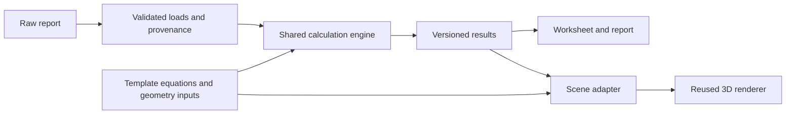

# Reusing open-source implementations for template-driven 3D

Research date: 2026-10-06. This is a source review and integration recommendation,
not a shipped 3D feature or an integration benchmark. It supports [offline project
planning, issue #32](https://github.com/amaljithkuttamath/mcdxkit/issues/32).

## Recommendation

Retain MCDXKit's shared Calcpad calculation path. Prototype a small adapter from
identified template inputs/results into a locally bundled Three.js scene. Start
with actual pile geometry, axes, load arrows and case selection. Evaluate
PyVista/trame instead if mesh fields, contours and richer scientific result
inspection become the main requirement. Do not adopt two renderers initially.

FreeCAD is the closest existing complete application to the proposed formula-to-3D
workflow. Evaluate it as a desktop CAD integration when editable solids or CAD
exchange are required. Rehosting the current browser workflow inside FreeCAD
would be a larger product change than adding a renderer.

## Existing implementations

| Implementation | What already exists | License and fit | Boundary |
| --- | --- | --- | --- |
| [FreeCAD](https://github.com/FreeCAD/FreeCAD) | Parametric CAD with Python scripting; spreadsheet expressions/aliases can drive dimensions and propagate edits through the model. | LGPL-2.1; desktop application on Windows, macOS and Linux. Strong candidate for an optional CAD integration. | Requires geometry bindings or translation. This research establishes no native Mathcad execution capability. |
| [CalcpadCE](https://github.com/imartincei/CalcpadCE) | The calculator already used by MCDXKit. Upstream Calcpad documents parameterized SVG diagrams, plots and reports. | MIT; reuse the existing pinned engine and bridge. | Current translator support is narrower than upstream features. SVG/plots do not establish a structural 3D simulation. |
| [Three.js](https://github.com/mrdoob/three.js) | Browser scene graph, geometry, camera controls, picking and helpers for drawing vectors. | [MIT](https://threejs.org/license/); best initial fit for the existing browser UI. Bundle assets locally. | Renderer only. MCDXKit must supply geometry, units, axes, provenance and actual result values. |
| [PyVista](https://github.com/pyvista/pyvista) with [trame](https://github.com/Kitware/trame) | VTK scientific visualization with browser-facing client/server rendering modes. | [PyVista MIT](https://github.com/pyvista/pyvista/blob/main/LICENSE); trame Apache-2.0; [trame-vtk BSD-3-Clause](https://github.com/Kitware/trame-vtk). Stronger fit for meshes and result fields. | Larger runtime and deployment footprint. Rendering mode and fully offline packaging need a prototype. No calculation or Mathcad compatibility follows from rendering support. |
| [PyNite](https://github.com/JWock82/Pynite) | Structural analysis and an existing viewer for model loads, result contours and scaled deformed shapes. | MIT. Reuse candidate when a frame-analysis model is explicitly required. | Not established here as a replacement for GROUP soil/pile interaction analysis. Changing solvers requires model and numerical validation. |

These are upstream project licenses, not a complete dependency license inventory.
Choose and pin an exact revision, retain notices and inspect transitive dependencies
before distributing a new integration. MCDXKit's MIT license does not relicense
upstream components.

## Concrete code and examples worth reusing

- FreeCAD's [spreadsheet documentation](https://github.com/FreeCAD/FreeCAD-documentation/blob/main/wiki/Spreadsheet_Workbench.md) explains cell aliases, units, model parameter references and recomputation. This documentation mirror is archived; the feature is also demonstrated in the [official spreadsheet/parametric design tutorial](https://blog.freecad.org/2025/04/08/tutorialgetting-started-with-spreadsheets-and-parametric-design/). Use explicit named bindings, not screen coordinates.
- Three.js's [ArrowHelper implementation](https://github.com/mrdoob/three.js/blob/dev/src/helpers/ArrowHelper.js) provides reusable vector geometry. Feed normalized directions and explicit display scales into it; arrow length is not automatically an engineering unit.
- PyVista's [trame backend examples](https://docs.pyvista.org/user-guide/jupyter/trame.html) show established web rendering paths. Trame also publishes [application examples](https://kitware.github.io/trame/examples/). Benchmark one representative model before taking on the VTK distribution cost.
- PyNite's [renderer documentation](https://pynite.readthedocs.io/en/stable/rendering.html) and [Visualization.py](https://github.com/JWock82/Pynite/blob/main/Pynite/Visualization.py) demonstrate load display, selected combinations and scaled deformation. Its deformation view requires calculated results and has load-case/combination restrictions.
- Calcpad's [feature documentation](https://calcpad.eu/help/1/about-calcpad) describes parameterized SVG; [plot documentation](https://calcpad.eu/Help/24/plotting) describes plots and maps. The pinned CalcpadCE source also includes `Calcpad.Core/Plotter/SvgDrawing.cs`. None of this proves arbitrary SVG templates are supported by MCDXKit's current strict translator.

## Formula and scene contract

The template supplies equations. The existing engine calculates supported
expressions once; worksheet results and the scene consume the same run. An adapter
maps named variables to physical meaning. A generic equation has no inherent
meaning such as pile length or weak-axis bending, so that binding cannot be guessed.

The proposed scene data must include coordinates and lengths with units, local and
global axes, section orientation, explicit pile/case IDs, input/result references,
and source/template/engine hashes. Unavailable values stay unavailable. Changes
invalidate the previous result until recalculation succeeds.

A summary envelope is a set of independently governing components. It is not one
simultaneous load state. Display envelopes as envelopes; show a physical load case
only when its associated values are available. Do not animate deformation from
capacity ratios or summary maxima. Use actual displacement fields or a separately
validated analysis model, with any visual exaggeration labeled.

## First prototype acceptance criteria

1. Use one synthetic template with known dimensions and results. Select a visible
   pile and trace its load to the exact source case and component.
2. Change a mapped input, recalculate, and prove the worksheet and scene read the
   same run and values. Do not add a second copy of a template equation in JavaScript.
3. Test axes, signs, unit conversion and missing bindings independently. Invalid
   mapping must block the affected scene feature instead of inventing defaults.
4. Reopen a saved project with network access denied. All UI assets, fonts,
   renderer code and required runtimes must be local; no login or CDN dependency.
5. Measure load time, memory and interaction on a representative project. Record
   the chosen renderer/revision and rejected alternatives in an architecture decision.

No renderer or solver above was installed or integration-tested for this research.
Native Mathcad Prime execution and structural adequacy remain separate validations.
